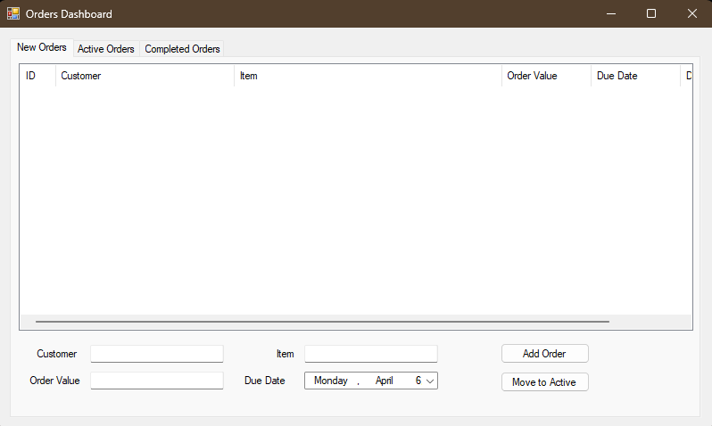

# order-management
A .NET Windows Form Application that can be used for order management that I built rather quickly as a small project to help organize orders for a business, made in C#

What it does
- Organizes New Orders, Active Orders, and Completed Orders into three sections
- Create a New Order by inputting Customer name or Order name, and then what the order is
- You can then move orders into Active and Completed sections when it is necessary
- Orders are organized by date created
- You can set a deadline so orders can also be sorted by a deadline
- Also added an Order Value column, so orders can be sorted by Order Value in $

